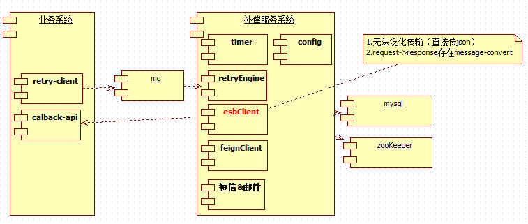
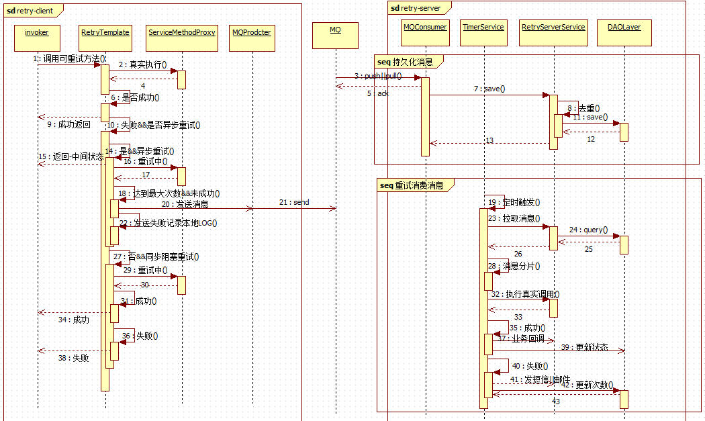
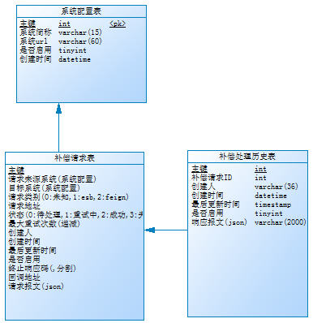

## 背景
	随着微服务化的系统越来越多，系统间的交互也呈现几何倍增的趋势，系统间面临一致性问题越来越突出。为了保障服务提供方与服务消费方的一致性，特别是面临最大努力通知型或补偿性的技术需求，服务化前做法是服务提供方需手写重试策略及各种配置->持久化消息->定时去处理消息等。它带来的以下问题是：
	1.客户端(新微服务)要做的重复性工作越来越多？需每个开发者熟悉它，去实现它；
	2.这个为什么这样个性化？标准不统一，出错率上升；
	3.说好的快速响应呢？我要做的狠简单，最好一行代码就可以实现它；
	4.维护成本上升；

## 接入须知

### 运行环境
- spring3.2.12(内部大多系统使用);
- springcloud Brixton系列(新系统)；

### 客户端与服务端遵循规约
- 接入系统(服务消费方)retry的代码块的颗粒度要求，但凡发起的remote调用，可独立为一个方法，方法内不允许有前置或后置处理，确保粒度控制在远程调用领域；
- 服务调用方的接口需满足幂等性设计；
- 接入系统(服务消费方)，为了避免理解有歧义，使用范围更规范，retry的作用于仅限于RetryCallable规约接口的实现方

## 功能特性
### retry-client
1. 全局开关，可配置自动扫描并注入；
2. 重试配置级别定义，支持类级和方法级(存在优先级)；
3. 重试配置项支持：
	- include：支持的异常，类型：Class<? extends Throwable>[] 
	- execPolicy：执行策略，默认同步
	- maxAttempts：重试次数，默认为3
	- delay：延迟执行毫秒数，默认为0
	- multiplier：重试执行间隔，默认为0
	- recoverMethod:回退的方法，重试失败后执行的方法，默认为null
	- callbackUrl：回调的url(相对url)，默认为null，不支持回调
	- isSendQueue:是否发送队列，默认true
	- ..

4. 同步策略，支持阻塞一直到成功或失败(最大次数)；
5. 异步策略，首次失败后，直接返回客户端(需处理中间状态)，后续一直重试，成功则回调；
6. 回调支持，主要是针对异步策略，客户端需提供回调接口；
7. 回退支持，可自定义通常达到最大次数后执行；
8. 重试失败消息落地，支持发送MQ

### retry-server
1. 消费消息并落地；
2. 定时处理库存中的请求，直到成功；
3. 可根据errorcode进行配置终止重试；
4. 成功时支持回调；
5. 失败时发送短信和邮件给系统责任人
6. 实现报表统计功能，可以展示top10接口调用失败后重试的情况

## 尚未实现
1. retry-server 在执行重试或回调时，目标服务需提供无状态接口(不携带cookie)，对身份授权有依赖需关注；
2. retry-server 执行重试间隔暂时不按照retry-client声明的定义，它统一集中化配置在项目中；
3. retry-client 目前仅限于发起的esb，feign(springcloud)调用，至于要支持各种业务代码方法的重试（远程方面需慎重考虑）

## 设计要求
- 无侵入：不改动当前的业务逻辑，对于需要重试的地方，可以很简单的实现；
- 通用性：可自定义包括重试次数，重试的间隔时间，是否使用异步方式等配置；
- 拓展性：关键实现的可替换(SPI)，同时API设计满足开放闭合原则；
- 健壮性：可监听所以关键的实现，便于排查问题，支持各种异常情况的处理，支持当前springcloud及spring3.x版本系列的接入；

## 具体实现
### 组件设计

### 交互时序

### 数据模型

### 内核实现
	主要调研了2款开源组件，spring-retry和guava-retry，从实现上来看2款基本上都可以满足当下的需求。但最后还是选择spring-retry，为何没选择guava-retry呢？首先讲，它不是不好，而是功能特性太单一(10分钟就可以读懂源码)、多实例的实现(每个method都要一个Retryer)，改造成本不小。
	spring-retry源于spring-batch，功能非常强大，还有熔断机制，拓展性强，下面介绍它的一些组件：
- RetryTemplate：包含execute，有没有种很熟悉的感觉，想想JdbcTemplate....
- RetryListener: aop切中它包含的方法，就会执行它的监听
- RetryConfiguration：定义了切面和通知，它包含AnnotationAwareRetryOperationsInterceptor
- AnnotationAwareRetryOperationsInterceptor：它其实就是个MethodInterceptor①实现，它invoke主要构建RetryTemplate并执行execute，说起来简单。但它又稍微对其进行了封装，根据注解声明，可以利用StatelessRetryInterceptorBuilder、StatefulRetryInterceptorBuilder、StatelessRetryInterceptorBuilder生成不同MethodInterceptor②的目标执行方法。最后再强调①的职责解析retry注解，并生成对应的②的实例，②的职责是执行真实的调用，并执行retry（注：②未必一定要定义为MethodInterceptor，其实可以把它看做一种规约而非AOP实现）。
- 最后，我们的内核实现上，如果定制化高改造①，如果定制化不高可以①->③(新增个性化)->②
	
## 快速开始

### 配置介绍
包含注解的说明，回调Api的设计

### 可拓展实现

### 示例程序

